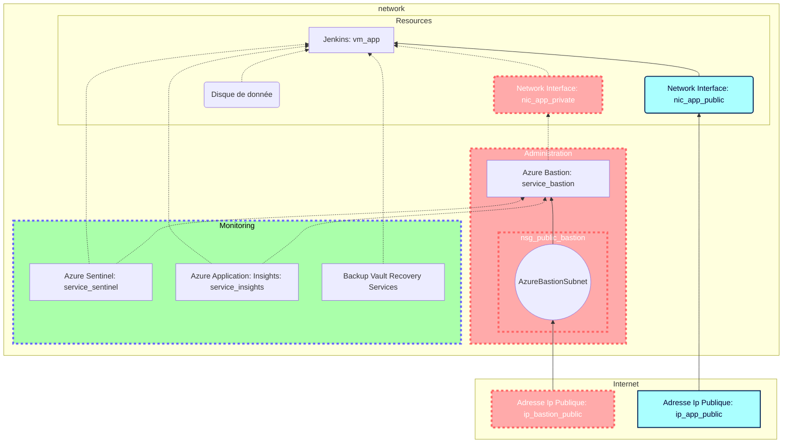

# Brief 3 : Déploiement scripté d’une application
> Réalisé avec : **Alain** et **Ryan**

## Sommaire

## Plan d'action


### Liste des tâches
- [x] Planifier les actions et les ressources à mettre en place.

    - [x] Créer la topologie de l'infrastructure
    - [x] Lister les ressources
    - [ ] Assigner les tâches
    - [x] Choix du langage de scripting
- [x] Production du premier script Python : **d'automatisation du déploiement de l'infrastructure**
    - [x] Brainstorming
    - [ ] Sélection des différentes commandes ainsi que l'ordre dans lequel elles seront appelées
        - [ ] Création de toutes les ressources (groupe de ressources, machines virtuelles, cartes réseaux, etc...)
    - [ ] Préparation du script : mise en place de l'architecture du programme
    - [x] Rédaction du script
    - [x] Test du script

- [x] Production du second script Python : **d'automatisation de l'installation de Jenkins et de ses dépendances**
    - [x] Brainstorming
    - [x] Installation des différents prérequis
        - [x] Installation de Jenkins
        - [ ] Installation du Certbot
    - [x] Rédaction du script
    - [x] Test du script
- [x] Fusion des deux scripts précédents (**déploiement** + **installation**)
- [x] Création d'une CLI
- [x] Rédaction de la documentation

### Liste des ressources

| Nom            | Type            | Description | Implémenté |
| - | - | - | - |
| Jenkins | Resource Group | | Oui |
| VNet | Virtual Network | Réseau virtuel contenant toute l'infrastructure   | Oui |
| VMApp | Virtual Machine | Machine virtuelle contenant l'application Jenkins | Oui |
| JenkinsBastion | Bastion | | Oui |
| AzureBastionSubnet | Virtual Network | Sous-réseau réservé au Bastion | Oui |
| JenkinsAppliSubnet | Virtual Network | Sous-réseau utilisé par Jenkins | Oui |
| NicBastion | Network Interface | Sous-réseau obligatoire pour le Bastion (masque /26) | Oui |
| NicAppli | Network Interface | IP Publique permettant l'accès depuis le navigateur en HTTP(S) | Oui |
| AppDiskData2 | Disk | Support de stockage pour la machine virtuelle applicative | Oui |
| Sentinel | Azure Sentinel | | Non |
| Insight | Azure Insight | | Non | 


### Topologie de l'infrastructure



## Documentation
### Environnement et prérequis

Pour fonctionner le script requiert l'installation de l'Azure CLI depuis le [site](https://docs.microsoft.com/en-us/cli/azure/install-azure-cli) de Microsoft. Ainsi qu'une extension `ssh` installable avec la commande : `az extension add --name ssh`

Téléchargeable depuis [GitHub](https://github.com/DevSoleo/simplon-brief-3), le script `app.py` a besoin de l'arborescence suivante pour fonctionner :
```
./simplon-brief-3/
├─ logs/
│  ├─ infrastructure.log
│  ├─ jenkins_installer.log
├─ config.json
├─ app.py
├─ jenkins_installer.py
├─ infrastructure.py
```


#### Fonctionnement

Le script éxécute une liste de commandes définies et paramétrées à l'avance (dans le fichier `./config.json`), afin de déployer l'infrastructure décrite plus haut, et d'y installer le service [Jenkins](https://www.jenkins.io/).

Après avoir déployé les ressources nécessaires au fonctionnement de l'infrastructure et du service, le script ouvrira une connexion vers la machine virtuelle applicative, en SSH, à travers le Bastion. Une fois connecté en SSH, par défaut, le script lancera l'installation de Jenkins sur la machine virtuelle.

Une fois l'infrastructure déployée et le service installé, le script renverra un code d'authentification (généré par Jenkins), permettant à l'utilisateur de se connecter et d'utiliser Jenkins pour la première fois.

Le comportement décrit ici est celui attendu lors de l'éxécution de la commande sans aucun argument. Il est possible de modifier l'ordre et la manière dont les actions s'effectuent en utilisant des arguments tels que `--deploy`, `--install` ou encore `--rollback`. 

Le script peut, au choix, afficher tous les logs dans le terminal, ou les enregistrer dans des fichiers dédiés (`./logs/infrastructure.log` et `./logs/jenkins_installer.log`).

#### Configuration

Toute la configuration du script est modifiable dans le fichier `config.json`.

```jsonld
{
    "rg_name": "Jenkins",
    "vnet_name": "VNet",
    "vm_name": "VMApp",
    "bastion_name": "JenkinsBastion",
    "bastion_nic_name": "NicBastion",
    "bastion_subnet_name": "AzureBastionSubnet",
    "appli_subnet_name": "JenkinsAppliSubnet",
    "appli_nic_name": "NicAppli",
    "admin_user_name": "azureuser",
    "key_path": "~/.ssh/id_rsa",
    "auth_type": "ssh-key",

    "location": "westeurope",
    "vnet_prefix": "10.0.0.0/16",
    "bastion_subnet_prefix": "10.0.3.0/24",
    "appli_subnet_prefix": "10.0.33.0/24",
    "bastion_ip": "10.0.3.1",
    "sku": "standard",

    "nsg_name": "port_8080",
    "app_disk_name": "AppDiskData2",
    "fqdn_name": "jenkinstest20"
}

```

#### Utilisation

> Les arguments présentés ci-dessous sont ceux déjà implémentés dans le script

Pour lancer le script (déploiement + installation):
`py ./app.py`

Pour déployer uniquement l'infrastructure :
`py ./app.py --install`

Pour déployer uniquement Jenkins sur une machine existante :
`py ./app.py --deploy`
